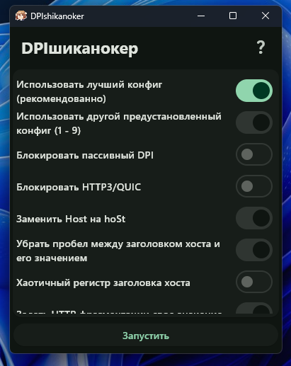

# DPIшиканокер
### Простой и одновременно мощный графический интерфейс для GoodByeDPI

> Интерфейс программы

#### Основной функционал
- Быстрое подключение
- Скрытие в трей, чтобы не мешалась иконка
- Самый важный функционал goodbyedpi

### Особенности
- Простой и современный интерфейс
- Приятный графический установщик
- Наличие portable версии

#### 3rd-party software
- GoodbyeDPI by ValdikSS
- Flutter by Google

## Скачать всегда можно на [странице релизов](https://github.com/axeinstd/DPIshikanoker/releases "Перейти на страницу релизов")

### License
> Copyrigth (C) 2024 Egor Antonov (axeinstd) (axeinstd@gmail.com)
This program is free software; you can redistribute it and/or modify it under the terms of the GNU General Public License as published by the Free Software Foundation; either version 3 of the License.
